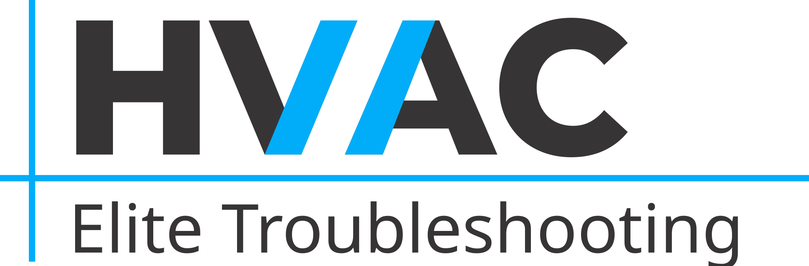

# HVAC Elite



**HVAC Elite** is a modern, bilingual (Georgian/English) Single Page Application (SPA) dedicated to professional Heating, Ventilation, and Air Conditioning services in Tbilisi, Georgia.

## 🚀 Features

- **Custom Vanilla JS SPA:** Built entirely without heavy frameworks (No React/Vue) for lightning-fast performance.
- **Client-Side Routing:** Seamless page transitions using the History API.
- **Bilingual Support (KA / EN):** Dynamic language switching with URL synchronization (e.g., `/ka/blog` vs `/en/blog`).
- **Dynamic SEO & Schema Markup:** Automatically injects Meta tags, OpenGraph, Twitter Cards, and JSON-LD schema (LocalBusiness, Article, FAQPage, Service) for optimal search engine visibility.
- **Responsive Design:** Custom CSS architecture using modern variables and design tokens, fully responsive across all devices.
- **Performance Optimized:** Uses WebP images, Intersection Observers for scroll animations, and minimal DOM repaints.

## 📁 Project Structure

```text
├── index.html         # Main entry point
├── _redirects         # Cloudflare Pages routing rule
├── robots.txt         # SEO robot rules
├── sitemap.xml        # SEO sitemap
├── css/
│   ├── main.css       # Design tokens, variables, base styles
│   ├── layout.css     # Header, Footer, and structural components
│   └── pages.css      # Page-specific styling
├── images/            # WebP and SVG assets
└── js/
    ├── app.js         # Main application logic and SEO injection
    ├── router.js      # URL routing logic
    ├── store.js       # Global state management (Language, Path)
    ├── components/    # Reusable UI components (Header, Footer)
    ├── pages/         # Page templates (Home, Services, Blog, etc.)
    ├── blogposts/     # Individual blog post modules
    └── locales/       # Translation files (ka.js, en.js)
```

## 🛠️ Setup & Installation

Since this project is built with Vanilla JavaScript, HTML, and CSS, it requires no build step.

1. **Clone the repository:**
   ```bash
   git clone https://github.com/your-username/hvac-elite.git
   ```
2. **Run a local server:**
   You can use any local web server to run the project. For example, using VS Code Live Server, or Python:
   ```bash
   python -m http.server 8000
   ```
   Navigate to `http://localhost:8000`

## 🌍 Deployment

This project is configured to be hosted on **Cloudflare Pages** (or GitHub Pages).
- The `_redirects` file (`/* /index.html 200`) ensures that all routes fall back to `index.html`, allowing the Vanilla JS router to handle deep links.

## 📞 Contact

- **Website:** [hvacelite.ge](https://hvacelite.ge)
- **Phone:** +995 514 12 88 21
- **Location:** Tbilisi, Georgia
